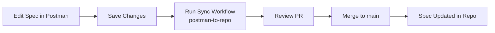
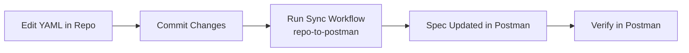

# Postman Spec Sync Examples

Quick reference examples for running the Postman Spec sync workflow.

NOTE: Please always use the `Create Pull Request` option when synching from Postman to your repo.  Otherwise you're likely to end up with divergent branches and have to rebase.  Using PRs is best practice.  IT MAY take a few seconds for the PR to actually show up in GitHub.  

## Common Scenarios

### 1. Sync OpenAPI Spec from Postman to Repo

**When to use:** You've been editing your OpenAPI spec in Postman and want to update the file in your repository.

```bash
# Via GitHub CLI
gh workflow run sync-postman-spec.yml \
  -f spec_id="your-spec-id-here" \
  -f file_path="postman/schemas/accounts-with-schema.yaml" \
  -f sync_direction="postman-to-repo" \
  -f create_pr=true

# Result: Creates a PR with the updated spec

# With debug mode (saves artifacts for troubleshooting)
gh workflow run sync-postman-spec.yml \
  -f spec_id="your-spec-id-here" \
  -f file_path="postman/schemas/accounts-with-schema.yaml" \
  -f sync_direction="postman-to-repo" \
  -f create_pr=true \
  -f debug=true
```

**Via GitHub UI:**
1. Go to Actions → "Sync Postman Spec with GitHub File"
2. Click "Run workflow"
3. Enter:
   - Spec ID: `your-spec-id`
   - File Path: `postman/schemas/accounts-with-schema.yaml`
   - Sync Direction: `postman-to-repo`
   - Create PR: ✅ Checked
4. Click "Run workflow"
   


5. The GitHub Pull Request should appear in a few seconds


---

### 2. Update Postman Spec from Repository

**When to use:** You've edited the YAML/JSON spec file in your repo and want to update Postman.

```bash
gh workflow run sync-postman-spec.yml \
  -f spec_id="your-spec-id-here" \
  -f file_path="postman/schemas/accounts-with-schema.yaml" \
  -f sync_direction="repo-to-postman" \
  -f create_pr=false

# Result: Updates the spec in Postman immediately
```

**Via GitHub UI:**
1. Go to Actions → "Sync Postman Spec with GitHub File"
2. Click "Run workflow"
3. Enter:
   - Spec ID: `your-spec-id`
   - File Path: `postman/schemas/accounts-with-schema.yaml`
   - Sync Direction: `repo-to-postman`
   - Create PR: ❌ Unchecked
4. Click "Run workflow"

   


---

### 3. Bi-Directional Sync (Safest Option)

**When to use:** You're not sure where the latest changes are, or want to keep both in sync.

```bash
gh workflow run sync-postman-spec.yml \
  -f spec_id="your-spec-id-here" \
  -f file_path="postman/schemas/accounts-with-schema.yaml" \
  -f sync_direction="both" \
  -f create_pr=true

# Result: Syncs in both directions as needed, creates PR if repo changed
```

---

### 4. Sync Multiple Specs (Script)

**When to use:** You have multiple specs to sync regularly.

```bash
#!/bin/bash

# accounts-with-schema.yaml
gh workflow run sync-postman-spec.yml \
  -f spec_id="abc123-spec-id-1" \
  -f file_path="postman/schemas/accounts-with-schema.yaml" \
  -f sync_direction="both" \
  -f create_pr=true

# accounts-to-start.yaml  
gh workflow run sync-postman-spec.yml \
  -f spec_id="def456-spec-id-2" \
  -f file_path="postman/schemas/accounts-to-start.yaml" \
  -f sync_direction="both" \
  -f create_pr=true

echo "✓ Sync workflows triggered for all specs"
```

Save as `sync-all-specs.sh` and run when needed.

---

### 5. Debug Mode - Troubleshoot Sync Issues

**When to use:** You're having sync issues and need to see the artifacts for debugging.

```bash
gh workflow run sync-postman-spec.yml \
  -f spec_id="your-spec-id" \
  -f file_path="postman/schemas/accounts.yaml" \
  -f sync_direction="repo-to-postman" \
  -f debug=true

# Result: 
# - Attempts sync
# - Saves artifacts with stringified content, payload, and API response
# - Artifacts available for download even if sync fails
```

**Via GitHub UI:**
1. Go to Actions → "Sync Postman Spec with GitHub File"
2. Click "Run workflow"
3. Enter parameters
4. ✅ Check "Enable debug mode"
5. Click "Run workflow"
6. After run completes, download artifacts from workflow page

**Download artifacts:**
```bash
# Get the run ID from the workflow URL or list recent runs
gh run list --workflow=sync-postman-spec.yml

# Download artifacts
gh run download {run-id} -n postman-sync-artifacts-{run-id}

# Inspect
cd postman-sync-artifacts-{run-id}
cat metadata.txt
cat api-response.json | jq .
```

---

### 6. One-Time Sync for New Spec

**When to use:** You've created a new spec in Postman and want to add it to the repo.

```bash
gh workflow run sync-postman-spec.yml \
  -f spec_id="new-spec-id" \
  -f file_path="postman/schemas/new-api.yaml" \
  -f sync_direction="postman-to-repo" \
  -f create_pr=true

# Result: Creates new file in repo with spec content
```

---

## Real-World Workflows

### Developer Workflow: Edit in Postman



**Commands:**
```bash
# After editing in Postman
gh workflow run sync-postman-spec.yml \
  -f spec_id="your-spec-id" \
  -f file_path="postman/schemas/accounts.yaml" \
  -f sync_direction="postman-to-repo" \
  -f create_pr=true

# Review PR in GitHub, then merge
```

---

### Developer Workflow: Edit in Repo



**Commands:**
```bash
# After committing changes to repo
git add postman/schemas/accounts.yaml
git commit -m "Update API spec: Add new endpoint"
git push

# Sync to Postman
gh workflow run sync-postman-spec.yml \
  -f spec_id="your-spec-id" \
  -f file_path="postman/schemas/accounts.yaml" \
  -f sync_direction="repo-to-postman" \
  -f create_pr=false
```

---

### Team Workflow: Regular Sync

**Setup a daily sync to ensure consistency:**

```yaml
# Add to .github/workflows/sync-postman-spec.yml
on:
  schedule:
    - cron: '0 9 * * 1-5'  # 9 AM weekdays
  workflow_dispatch:
    # ... existing inputs ...
```

Or run manually:
```bash
# Every morning, sync all specs
./sync-all-specs.sh
```

---

## Postman API Examples

### Get All Your Specs

Find your Spec IDs:

```bash
curl -X GET "https://api.postman.com/specs" \
  -H "X-Api-Key: YOUR_POSTMAN_API_KEY" \
  -H "Accept: application/vnd.api.v10+json" | jq
```

Response:
```json
{
  "specs": [
    {
      "id": "abc123-def456-ghi789",
      "name": "Retail Accounts API",
      "type": "OPENAPI:3.0"
    }
  ]
}
```

### Get Spec Details

```bash
curl -X GET "https://api.postman.com/specs/YOUR_SPEC_ID" \
  -H "X-Api-Key: YOUR_POSTMAN_API_KEY" \
  -H "Accept: application/vnd.api.v10+json" | jq
```

### Get Spec Files

```bash
curl -X GET "https://api.postman.com/specs/YOUR_SPEC_ID/files" \
  -H "X-Api-Key: YOUR_POSTMAN_API_KEY" \
  -H "Accept: application/vnd.api.v10+json" | jq
```

---

## GitHub Actions API Examples

### Trigger Workflow via API

```bash
curl -X POST \
  "https://api.github.com/repos/OWNER/REPO/actions/workflows/sync-postman-spec.yml/dispatches" \
  -H "Authorization: token YOUR_GITHUB_TOKEN" \
  -H "Accept: application/vnd.github+json" \
  -d '{
    "ref": "main",
    "inputs": {
      "spec_id": "your-spec-id",
      "file_path": "postman/schemas/accounts.yaml",
      "sync_direction": "both",
      "create_pr": "true"
    }
  }'
```

### List Workflow Runs

```bash
gh run list --workflow=sync-postman-spec.yml --limit 10
```

### View Workflow Run Details

```bash
gh run view <run-id>
```

---

## Configuration Files

### Create a Sync Configuration File

`sync-config.json`:
```json
{
  "specs": [
    {
      "name": "Retail Accounts API",
      "spec_id": "abc123-def456-ghi789",
      "file_path": "postman/schemas/accounts-with-schema.yaml",
      "sync_direction": "both"
    },
    {
      "name": "Authentication API",
      "spec_id": "xyz789-uvw456-rst123",
      "file_path": "postman/schemas/auth-spec.yaml",
      "sync_direction": "both"
    }
  ]
}
```

**Sync Script Using Config:**
```bash
#!/bin/bash

# Read config and sync all specs
jq -c '.specs[]' sync-config.json | while read spec; do
  spec_id=$(echo $spec | jq -r '.spec_id')
  file_path=$(echo $spec | jq -r '.file_path')
  sync_direction=$(echo $spec | jq -r '.sync_direction')
  name=$(echo $spec | jq -r '.name')
  
  echo "Syncing $name..."
  
  gh workflow run sync-postman-spec.yml \
    -f spec_id="$spec_id" \
    -f file_path="$file_path" \
    -f sync_direction="$sync_direction" \
    -f create_pr=true
    
  sleep 2  # Rate limiting
done

echo "✓ All specs synced"
```

---

## Troubleshooting Examples

### Test API Key

```bash
# Verify your Postman API key works
curl -X GET "https://api.postman.com/me" \
  -H "X-Api-Key: YOUR_POSTMAN_API_KEY" \
  -H "Accept: application/vnd.api.v10+json"
```

### Check Spec Exists

```bash
# Verify spec ID is valid
curl -X GET "https://api.postman.com/specs/YOUR_SPEC_ID" \
  -H "X-Api-Key: YOUR_POSTMAN_API_KEY" \
  -H "Accept: application/vnd.api.v10+json"

# If 404, spec doesn't exist or you don't have access
```

### Verify File Path

```bash
# Check file exists in repo
ls -la postman/schemas/accounts-with-schema.yaml

# If file doesn't exist, create it or sync from Postman first
```

### Check Workflow Status

```bash
# View recent workflow runs
gh run list --workflow=sync-postman-spec.yml

# View specific run
gh run view <run-id>

# Watch a run in real-time
gh run watch
```

### Test Content Stringification

```bash
# Test how your YAML file will be stringified for JSON transmission
cat postman/schemas/accounts-with-schema.yaml | jq -Rs .

# Expected output: JSON string with \n for newlines
# Example: "openapi: 3.0.0\ninfo:\n  title: My API\n  version: 1.0.0\n"

# Test full JSON payload creation
file_content=$(cat postman/schemas/accounts-with-schema.yaml | jq -Rs .)
echo "$file_content" | jq -n --argjson content "$file_content" '{content: $content}'

# This shows exactly what will be sent to Postman API
```

### Verify File Encoding

```bash
# Check file encoding (should be UTF-8)
file -I postman/schemas/accounts-with-schema.yaml

# Convert to UTF-8 if needed
iconv -f ISO-8859-1 -t UTF-8 input.yaml > output.yaml

# Check for null bytes or invalid characters
cat postman/schemas/accounts-with-schema.yaml | od -c | grep '\\0'
```

### Download and Inspect Artifacts

```bash
# List artifacts for a workflow run
gh run view {run-id} --json artifacts

# Download artifacts from a specific run
gh run download {run-id} -n postman-sync-artifacts-{run-id}

# View the downloaded artifacts
cd postman-sync-artifacts-{run-id}
ls -la

# Inspect the stringified content
cat stringified-content.txt

# View the JSON payload
cat json-payload.json | jq .

# Check what was synced
cat source-file-path.txt
cat spec-id.txt

# View sync metadata
cat metadata.txt

# Check API response (if sync was attempted)
if [ -f "api-response.json" ]; then
  cat api-response.json | jq .
else
  echo "API was not called (files were already in sync)"
fi
```

### Debug Failed Syncs

```bash
# Download artifacts from a failed run
gh run download {run-id} -n postman-sync-artifacts-{run-id}
cd postman-sync-artifacts-{run-id}

# Check sync status
grep "sync_status" metadata.txt
# Output: sync_status=failed

# Check HTTP status code
grep "http_status" metadata.txt
# Output: http_status=400

# View the error response
cat api-response.json | jq .

# Compare what was sent vs what should have been sent
cat json-payload.json | jq -r '.content' | head -n 20

# Verify stringification is correct
cat stringified-content.txt | head -c 500
```

**Example Artifact Contents:**

```bash
# stringified-content.txt
"openapi: 3.0.0\ninfo:\n  title: Retail Accounts API\n  version: 1.0.0\npaths:\n  /accounts:\n    get:\n      summary: Get accounts\n..."

# json-payload.json
{
  "content": "openapi: 3.0.0\ninfo:\n  title: Retail Accounts API\n  version: 1.0.0\npaths:\n  /accounts:\n    get:\n      summary: Get accounts\n..."
}

# source-file-path.txt
postman/schemas/accounts-with-schema.yaml

# spec-id.txt
abc123-def456-ghi789

# metadata.txt
root_file=index.yaml
sync_timestamp=2025-01-07T14:30:45Z
needs_sync=true
http_status=200
sync_status=success

# api-response.json (only present if API was called)
{
  "file": {
    "id": "abc123",
    "path": "index.yaml",
    "type": "ROOT"
  },
  "updatedAt": "2025-01-07T14:30:46Z"
}
```

**Key Points:**
- ✅ All artifacts (except `api-response.json`) are saved **BEFORE** the API call
- ⚠️ `api-response.json` is only present if the Postman API was actually called
- 📦 Artifacts are available even if the sync fails, making debugging easier
- 🔄 The artifact is uploaded twice: before and after the API call (to add response)

---

## Quick Reference

### Sync Directions

| Direction | Updates | Use Case |
|-----------|---------|----------|
| `postman-to-repo` | Repo from Postman | Edited in Postman |
| `repo-to-postman` | Postman from Repo | Edited in Repo |
| `both` | Both if needed | Regular sync/unsure |

### Create PR Options

| Value | Behavior | Use Case |
|-------|----------|----------|
| `true` | Creates PR | Want review before merge |
| `false` | Direct commit | Trust automated sync |

### Artifacts

| Artifact | Description | Availability |
|----------|-------------|--------------|
| `postman-sync-artifacts-{run-id}` | Debug files from sync | Only when `debug=true` |
| Retention | 7 days | Auto-deleted after |

**⚠️ Note:** Artifacts are only created when debug mode is enabled (`debug=true`)

**Artifact Contents:**
- `stringified-content.txt` - Raw stringified file
- `json-payload.json` - Complete API payload
- `source-file-path.txt` - Source file path
- `spec-id.txt` - Postman spec ID
- `metadata.txt` - Sync metadata with timestamp and status
- `api-response.json` - Postman API response (if API was called)

**Why debug mode?**
- Saves storage space by not creating artifacts for successful syncs
- Only generate artifacts when troubleshooting is needed
- All files still created locally for the sync process to work

---

## Demo-Accounts Specific Examples

### Sync accounts-with-schema.yaml

```bash
gh workflow run sync-postman-spec.yml \
  -f spec_id="YOUR_SPEC_ID" \
  -f file_path="postman/schemas/accounts-with-schema.yaml" \
  -f sync_direction="both" \
  -f create_pr=true
```

### Sync accounts-to-start.yaml

```bash
gh workflow run sync-postman-spec.yml \
  -f spec_id="YOUR_SPEC_ID" \
  -f file_path="postman/schemas/accounts-to-start.yaml" \
  -f sync_direction="both" \
  -f create_pr=true
```

### After Making Changes in Postman

```bash
# 1. Update local repo from Postman
gh workflow run sync-postman-spec.yml \
  -f spec_id="YOUR_SPEC_ID" \
  -f file_path="postman/schemas/accounts-with-schema.yaml" \
  -f sync_direction="postman-to-repo" \
  -f create_pr=true

# 2. Wait for PR to be created
# 3. Review PR: gh pr view

# 4. Merge PR: gh pr merge --auto --squash

# 5. Pull changes: git pull
```

---

## Help & Support

**Common Commands:**
```bash
# List workflows
gh workflow list

# View workflow file
gh workflow view sync-postman-spec.yml

# Trigger workflow
gh workflow run sync-postman-spec.yml -f spec_id=... -f file_path=...

# Check run status
gh run list --workflow=sync-postman-spec.yml

# View run logs
gh run view --log
```

**Documentation:**
- Workflow README: `.github/workflows/README.md`
- Postman API: https://www.postman.com/postman/workspace/postman-public-workspace/documentation
- GitHub Actions: https://docs.github.com/en/actions

---

**Quick Start:**
1. Get your Postman API key
2. Add to GitHub secrets as `POSTMAN_API_KEY`
3. Get your Spec ID from Postman
4. Run workflow from Actions tab or via CLI
5. Review and merge PR

